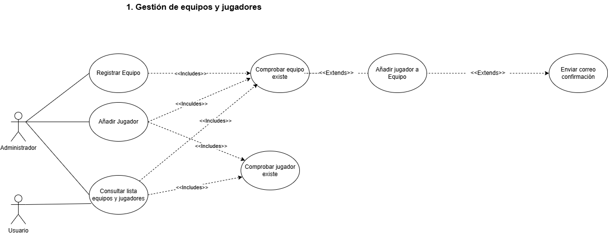
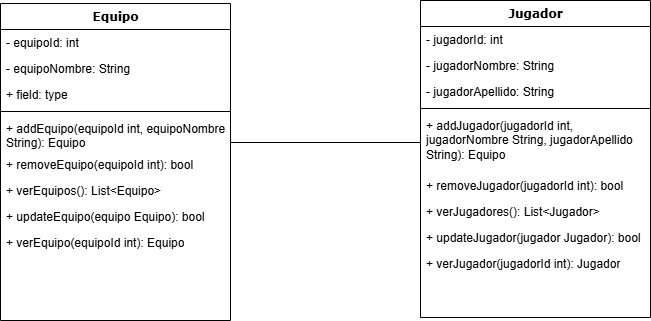

# Sistema de Gestión de Torneos de eSports
## Autor
Juan Carlos Calvo Villardón

https://github.com/juancarloscalvo
## Descripción del Proyecto
https://github.com/juancarloscalvo/torneo-esports-uml

Este proyecto implementa un sistema de gestión de torneos de eSports
utilizando UML para el modelado y Java para la implementación.
## Diagramas UML
### Diagrama de Casos de Uso

### Diagrama de Clases

## Estructura del Proyecto
torneo-esports-uml/

├── diagrams/

│ ├── casos-uso.png

│ ├── clases.png

├── README.md

## ¿Quiénes son los actores que interactúan con el sistema?
Los actores serían los Administradores y los jugadores.

## ¿Cuáles son las acciones que cada actor puede realizar?
Los Administradores pueden realizar todas las gestiones relacionadas con el torneo (crear torneos, registrar equipos, actualizar clasificaciones, puntuaciónes)
y los usuarios pueden consultar el listado de equipos y jugadores así como la clasificación del torneo.

## ¿Cómo se relacionan entre sí las entidades del sistema?
Las entidades se relacionan entre si comprobando y verificando la existencia de torneos, de equipos y emparajmientos. Cuando se registra un resultado, por ejemplo, a la vez se actualiza la clasificacion. También se puede actualizar la clasificacion de forma independiente.

## Justificación del diseño
Se crea un sistema con los casos de uso de registrar equipo, añadir jugador y consultar lista de equipos y jugadores, los Administradores tienen acceso a todo y los usuarios sólo pueden consultar listas de equipos y jugadores. 
- En los caso de uso de Añadir jugador se comprueba que el jugador no exista antes. De forma opcional extiende la comprobación del equipo para añadir el jugador a un equipo y a su vez enviar un correo de confirmación
- En el caso de uso Registrar equipo, se comprueba que no exista antes, y se añade un jugador a ese equipo.
- En el caso de uso de Consultar lista de equipos y jugadores se comprueba que existan tanto los jugadores como los equipos.
  
## Conclusiones
Gracias a este ejercicio he comprendido que se pueden identificar y representar los casos de uso principales de un sistema y también a diseñar el diagrama de clases para organizar las entidades y sus relaciones. Esto me ha ayudado a entender mejor cómo planificar y estructurar una aplicación desde el inicio.
